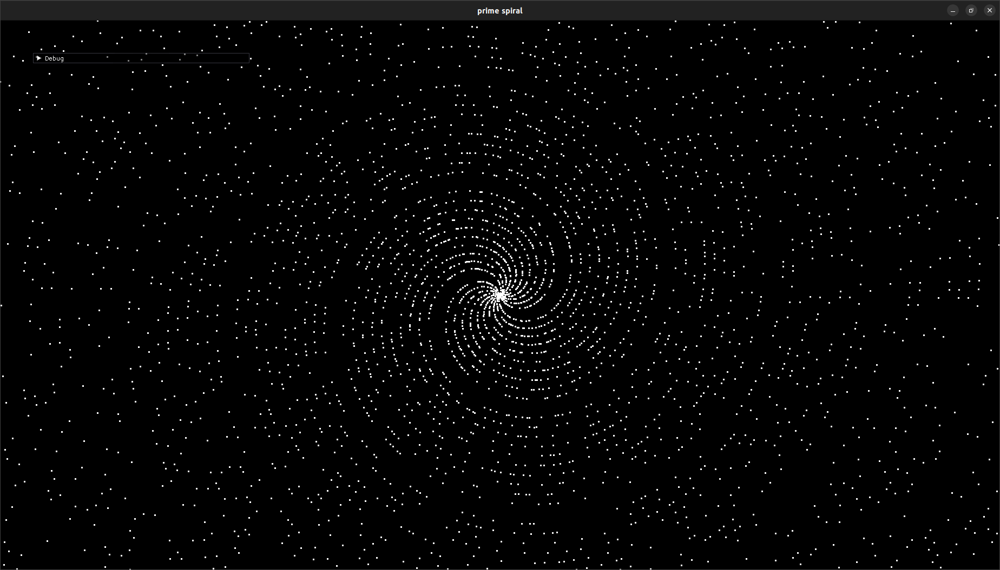
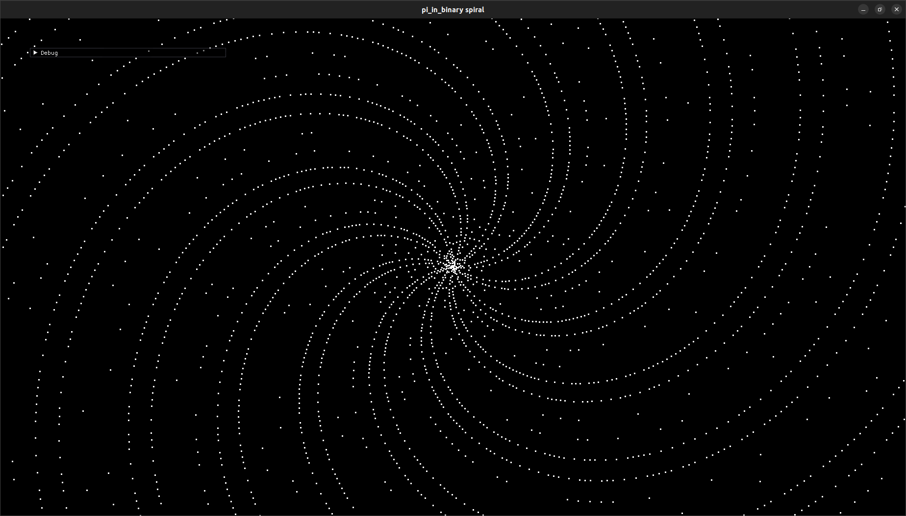
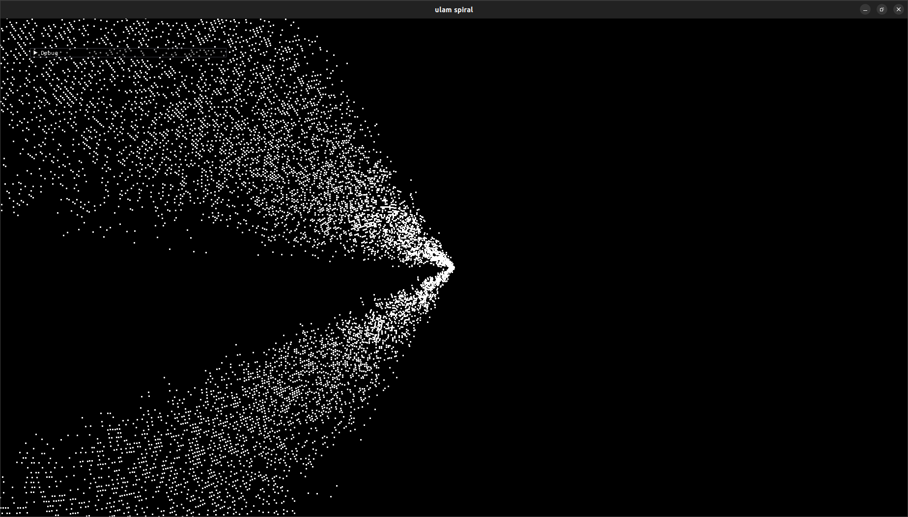

 

### [Launch](https://thenumbernine.github.io/glapp-js/run.html?dir=prime-spiral&file=run.lua)

Hooray, it makes those spiral patterns.

Prime spiral:

Pi digit spiral:

To use the pi-digit-spiral option, you will have to download your favorite txt file of the digits of pi, and put it in this folder as the file "pi".  I guess one place to look is [https://github.com/eneko/Pi/blob/master/one-million.txt]

Ulam spiral:

