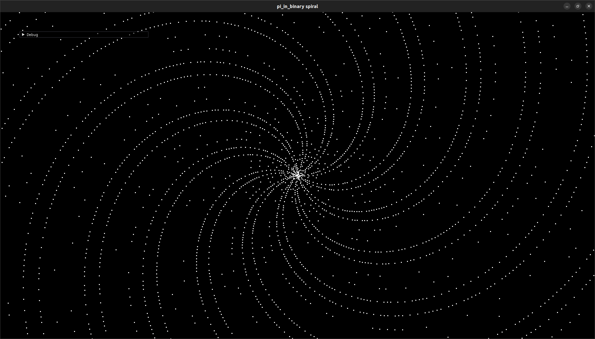

It makes those dumb prime spirals

Download your favorite txt file of the digits of pi, and put it in this folder as the file "pi".

I guess one place to look is [https://github.com/eneko/Pi/blob/master/one-million.txt]

